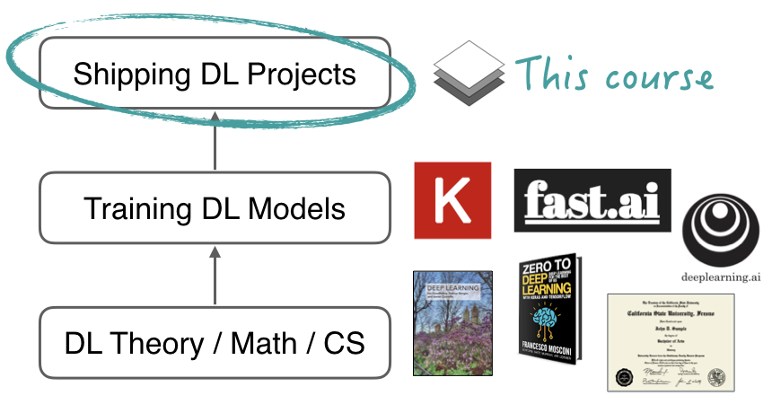
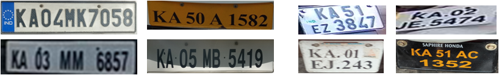
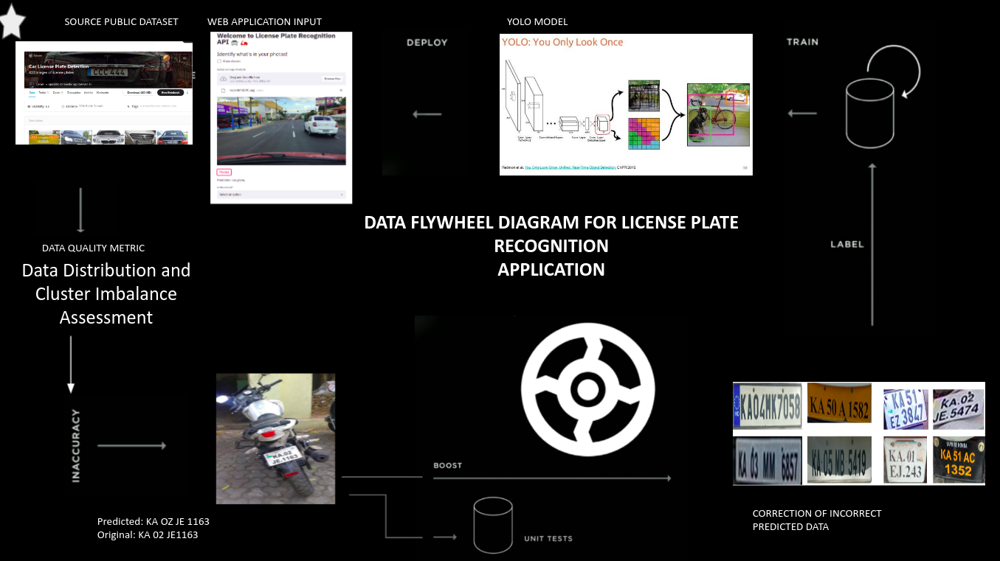
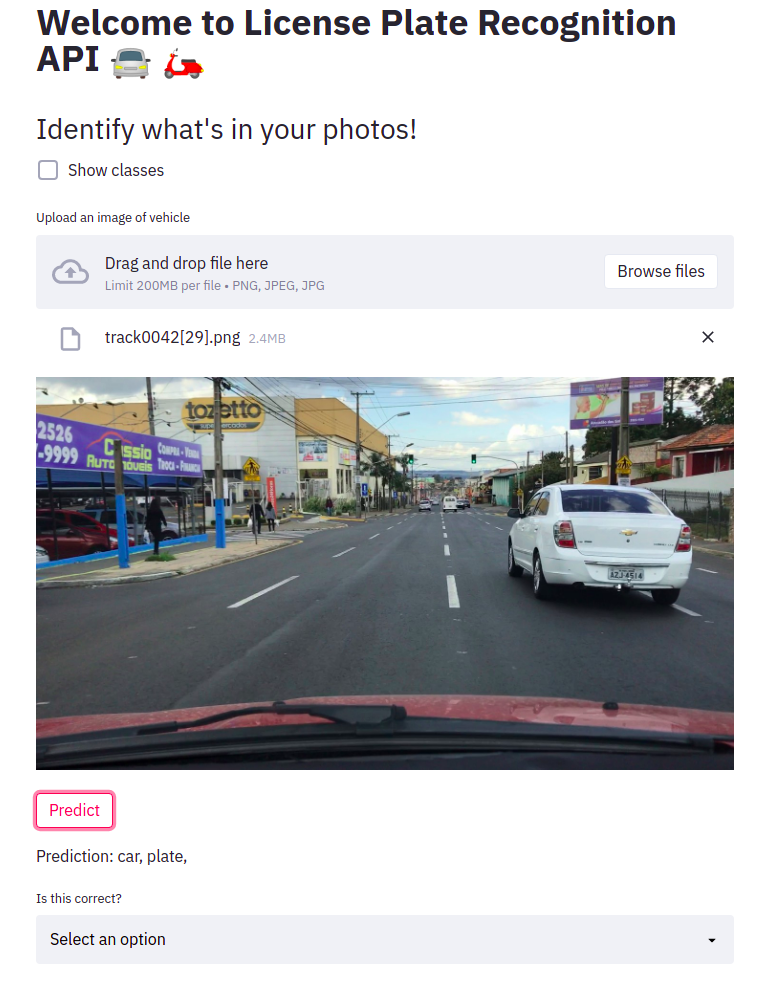
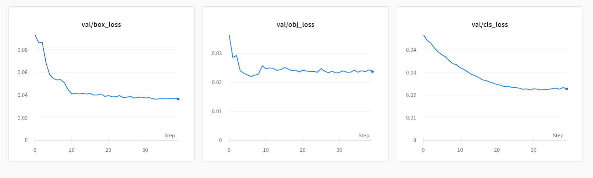
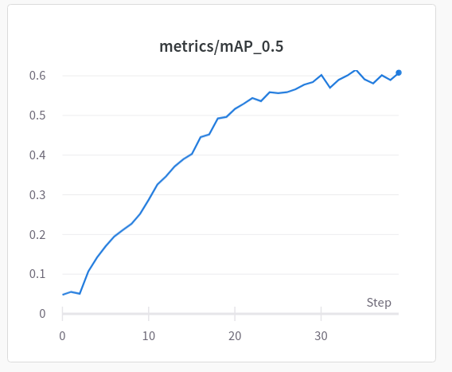
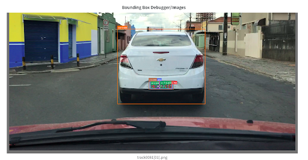
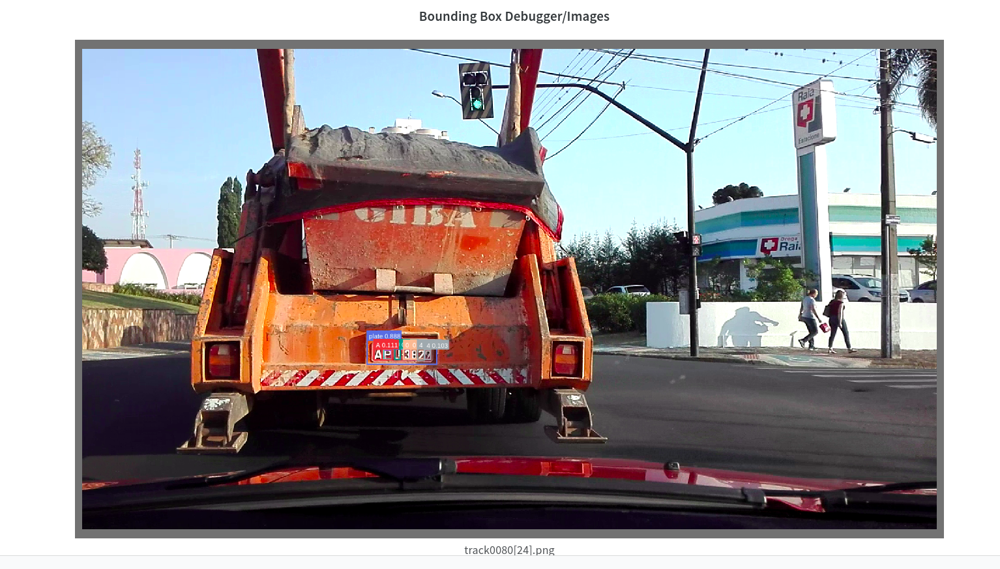

# FSDL Spring 2021

# How to Integrate Dataset Quality Metrics And Flywheel in a MLOps Pipeline 

# ( Demonstration using License Plate Recognition App )

### Authors

[Changsin lee](https://www.linkedin.com/in/changsin/), [Mahavir Dwivedi](https://www.linkedin.com/in/mahavir-dwivedi/)

## Introduction
As we know that an AI system involves two major pillars, one is code(model + algorithm) and the other is data. In a recent [interview]((https://panel.holoviz.org/reference/panes/HoloViews.html)) Andrew Ng mentioned the importance of high quality data.
Through this project we would like to focus on the data aspect of an AI system.
The project aims to demonstrate the improvement in model performance using Data Quality Metrics and Data Flywheel concept.


### Data Quality Metric
Visit this repository to know more about our latest work on Data Qulaity Metric Hypothesis.
[https://github.com/changsin/FSDL](https://github.com/changsin/FSDL)
### Repository Structure
Training code can be found in training directory.
Notebooks used can be found in notebooks directory.
License Plate Recognition app in license_plate_recogniser directory.

### License Plate Recognition Application (LPR)

To use LPR application install docker app. 
Clone the repository and go inside the license_plate_recogniser directory, build the docker image using command:
```bash
docker build --network host -t lpr:latest .
```
To start the container run.
```bash
docker run -it --network host -p 8080:8080 lpr
```
Now visit your browser and access the url:
```bash
localhost:8080
```
You should be at this page:


The dashboard is built using streamlit.


### Deploying on GCP:
To get this app running on a cloud, we use google ecosystem.

Be aware if you are executing this step, you will be billed by Google.

TO run the app on cloud, visit license_plate_recogniser directory and execute:
```bash
make Makefile
```
If everything is fine on your end, you should have a service running in your Google console dashboard.
We are using Google's serverless option , Google cloud Run for running this app on cloud.

### Model Training

We have used Yolov5 as our baseline model.
To replicate the traing process, you can visit this colab notebook:
[](https://github.com/mahavird/fsdl_project/blob/main/notebooks/LPR_Train.ipynb)

We used Weights and Bias for experiment tracking.
Here are our validation loss curves, mean mAP and Predicition Images.





### Dataset:
Datasets used in the project are:

1. [Kaggle License Plate Dataset](https://www.kaggle.com/andrewmvd/car-plate-detection)
2. [UFPR License Plate Dataset](https://web.inf.ufpr.br/vri/databases/ufpr-alpr/)

### Tech Stack used
1. Pytorch
2. Streamlit
3. Docker
4. Weights and Bias
5. Google Cloud Run


### Future Work:
1. Completion of data flywheel loop to integrate active learning 
2. Replicate results of SOTA papers for UFPR dataset
3. Integrate Data Qulaity Metric in the pipeline
4. Include results on other License Plate Datasets

### References:

1. [Full Stack Deep Learning](https://fullstackdeeplearning.com/)
2. [Yolov5](https://github.com/ultralytics/yolov5)
3. [Streamlit Tutorial](https://github.com/mrdbourke/cs329s-ml-deployment-tutorial)
